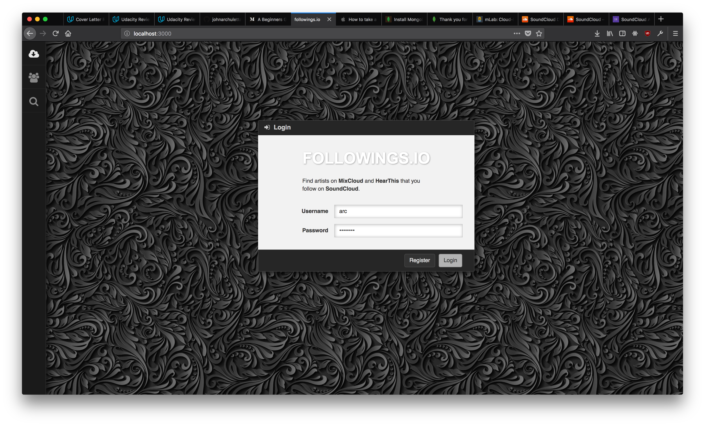
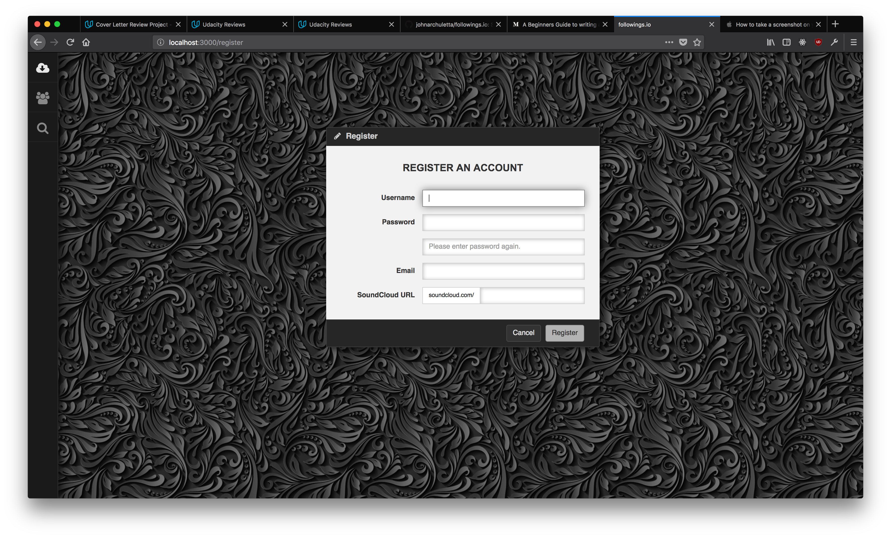
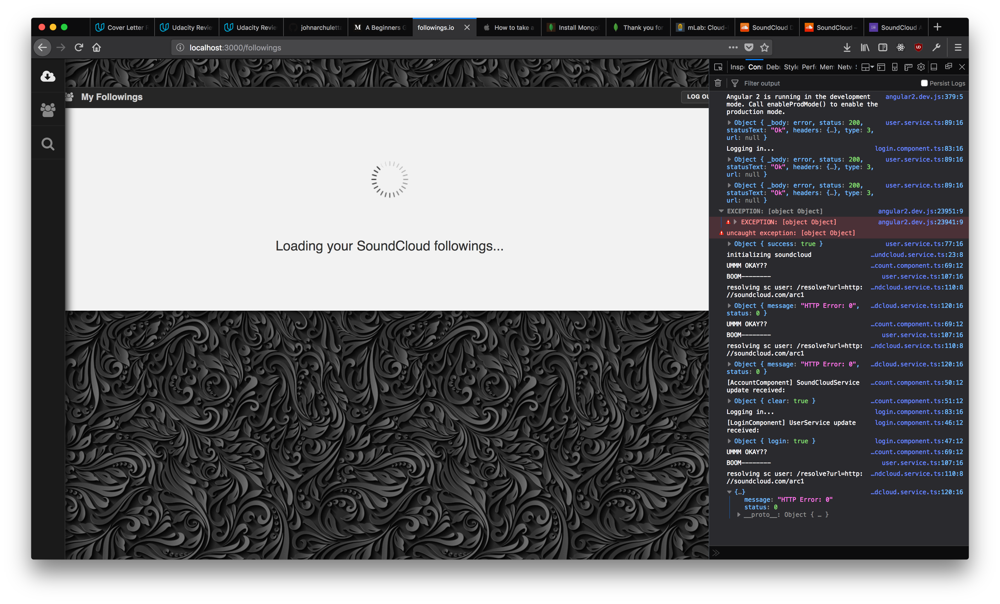

# Followings.io

Search popular music streaming sites for artists you like based on who you follow on SoundCloud.

## Motivation

One of the main reasons users continue to use a particular service despite their general dissatisfaction with it, is because they've already invested lots of time and energy into said service. This app aims to help lower the amount of effort needed to switch over to competing products by automating the work they would otherwise have to do by hand.

## Project Status

Currently, the project is not in active development or publicly deployed. The main reason being because SoundCloud has closed it's public APIs and SDK, which has rendered this project non-functional.

## Technologies Used

The app was built with the following technologies:
- Angular 2 (beta phase)
- NodeJS
- Express
- MongoDB

## Screenshots

Login Page:

User Registration Page:

Main Page: (Non-functional do to discontinued SoundCloud API/SDK)

## Features

Users can login with SoundCloud, which automatically retrieves all of the artists they are currently following. With this list, the app can conduct searches for those artists on MixCloud and HearThis.

Finding all the artists you like on music streaming services are typically a very labor intensive process, which makes using other services more work than it's worth. This app however aims to automate that process, making it much easier to find and build your collection of artists that you want to follow.

## API Reference

The public APIs used in this app are:

- [SoundCloud](https://developers.soundcloud.com/docs/api/guide)
- [MixCloud](https://www.mixcloud.com/developers/)
- [HearThis](https://hearthis.at/api-v2/)

## How to use?

If you would like to run the project on your local machine, do the following.

- Clone repository into local folder.
- Install Node dependencies: `npm install --save`
- Execute: `node server/server.js`
- An Express server should now be running at: [http://localhost:3000/](http://localhost:3000/)

If you are just interested in reading the tasty parts of the code, you can find the most important stuff in `/public/js/app` starting with `app.component.ts`. The `services` folder is also of particular interest for those wanting to know how it all works.

## License

MIT © John Archuletta

Permission is hereby granted, free of charge, to any person obtaining a copy of this software and associated documentation files (the "Software"), to deal in the Software without restriction, including without limitation the rights to use, copy, modify, merge, publish, distribute, sublicense, and/or sell copies of the Software, and to permit persons to whom the Software is furnished to do so, subject to the following conditions:

The above copyright notice and this permission notice shall be included in all copies or substantial portions of the Software.

THE SOFTWARE IS PROVIDED "AS IS", WITHOUT WARRANTY OF ANY KIND, EXPRESS OR IMPLIED, INCLUDING BUT NOT LIMITED TO THE WARRANTIES OF MERCHANTABILITY, FITNESS FOR A PARTICULAR PURPOSE AND NONINFRINGEMENT. IN NO EVENT SHALL THE AUTHORS OR COPYRIGHT HOLDERS BE LIABLE FOR ANY CLAIM, DAMAGES OR OTHER LIABILITY, WHETHER IN AN ACTION OF CONTRACT, TORT OR OTHERWISE, ARISING FROM, OUT OF OR IN CONNECTION WITH THE SOFTWARE OR THE USE OR OTHER DEALINGS IN THE SOFTWARE.